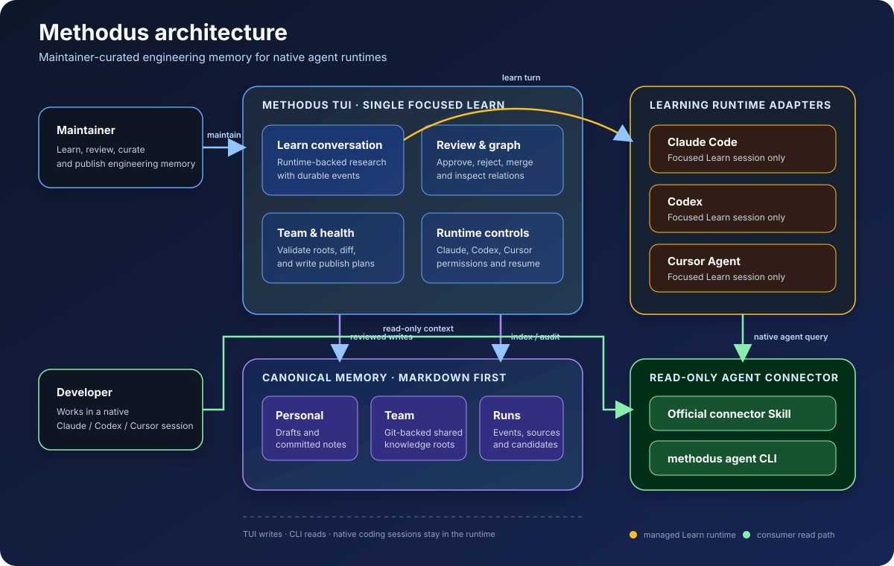

# Methodus

Methodus is a local-first engineering knowledge studio for teams that use Claude
Code, Codex, Cursor, or another native agent runtime.

Maintainers use the TUI to investigate a learning goal, challenge assumptions, verify
evidence, and review durable Knowledge, Method, and Experience candidates. Developers
stay in their preferred agent runtime and receive reviewed context through a small,
read-only Methodus CLI connector.



## Product boundary

Methodus owns the moments around agent work:

```text
maintainer goal
  → focused Learn conversation
  → evidence and counterexample checks
  → CandidateSet proposal
  → maintainer review
  → Personal / Team Markdown knowledge
```

For ordinary development work:

```text
developer in Claude Code / Codex / Cursor
  → official connector Skill
  → methodus agent (read-only)
  → bounded Method / Knowledge / Experience context
  → native runtime continues the task
```

Methodus is not a coding-agent replacement, MCP server, task workspace manager,
runtime handoff layer, generic Skill manager, Face system, or automatic graph writer.
Native coding sessions and runtime permissions remain owned by the user and the
selected agent runtime.

## Quick start

Run the maintainer studio:

```bash
cargo run -p methodus
```

The first launch creates `~/.methodus/` and seeds the local Markdown graph. Install
the read-only connector Skill for the runtimes you use:

```bash
cargo run -p methodus -- setup --runtime all
cargo run -p methodus -- doctor
```

`setup` is ownership-aware. It only updates a Methodus-owned connector and refuses to
overwrite an unrelated Skill. Use `--force` only to replace a connector that already
belongs to Methodus. Uninstall is explicit:

```bash
cargo run -p methodus -- setup --runtime claude-code --uninstall
```

## Maintainer workflow

The default TUI is a focused Learn conversation. Type an ordinary message to start or
continue the current learning goal. Use `@` to attach a repository, directory, file,
or other local source path.

- `/runtime` opens the Claude Code, Codex, and Cursor picker. `/runtime codex` selects
  one directly.
- `Shift+Tab` cycles `Read-only plan`, `Cautious execution`, and `Auto-edit`. The
  choice is visible beside the composer and persisted with the Learn run.
- `/new` closes the current learning context. The next ordinary input creates a new
  Learn run.
- `/quit` exits Methodus. An active Learn run remains resumable after restart; a run
  waiting for Review does not resume as a Runtime conversation.
- `/knowledge`, `/method`, `/experience`, `/review`, `/graph`, `/team`, and `/health`
  open the maintenance panels.
- `/help` shows the complete command and keyboard reference.

When the Runtime returns a structured CandidateSet, Methodus writes the research
record under `runs/` and review-only candidates under `personal/candidates/`. Nothing
becomes consumer-visible until a maintainer approves it.

## Agent connector

The connector Skill is intentionally small and runtime-neutral. It teaches an agent to
call the local read-only protocol for substantial work:

```bash
methodus agent prepare --goal "Diagnose abnormal device shutdown" --budget 1200
methodus agent search --query "previous shutdown reason" --type knowledge,experience
methodus agent get knowledge/previous-shutdown-reason --facet execute
methodus agent related knowledge/previous-shutdown-reason
methodus agent status
```

The CLI returns bounded Markdown by default or JSON with `--format json`. It never
writes the graph, starts a Runtime, reads an ordinary coding transcript, or blocks a
developer task when Methodus is unavailable.

## Storage model

Markdown/YAML is canonical for Knowledge, Method, Experience, typed relations, and
source references. SQLite is a rebuildable search/index projection. Learn and Review
operational state is file-backed:

```text
~/.methodus/
├── config.yaml
├── state.db
├── methodus.lock
├── personal/
│   ├── knowledge/
│   ├── methods/
│   ├── experiences/
│   └── candidates/
├── teams/<team-id>/
│   ├── knowledge/
│   ├── methods/
│   └── experiences/
├── runs/
│   ├── reviews.jsonl
│   └── <learn-run>/
│       ├── state.yaml
│       ├── events.jsonl
│       ├── assistant.md
│       └── sources.yaml
└── connectors/
```

Personal and Team content are separate roots. Team content remains ordinary Markdown
and Git; Methodus can validate it, show status and diff, and write a local publish
plan, but it does not silently commit, push, merge, or discard changes.

## Architecture and documentation

The architecture diagram is available as [SVG](docs/architecture.svg) and [PNG](docs/architecture.png).
The design source of truth is organized as follows:

- [Product contract](docs/00-product.md) — positioning, workflows, graph semantics,
  trust, and permanent boundaries.
- [Runtime adapters](docs/01-runtime-adapters.md) — focused Learn integration and
  connector behavior.
- [Architecture](docs/02-architecture.md) — processes, storage, indexing, and
  security boundaries.
- [Data model](docs/03-data-model.md) — Markdown nodes, evidence, lifecycle, and
  freshness.
- [Roadmap](docs/04-roadmap.md) — implementation status and remaining evaluation.
- [TUI](docs/05-tui.md) — maintainer interaction and keyboard behavior.
- [Agent CLI](docs/06-agent-cli.md) — stable read-only protocol.
- [Learning protocol](docs/07-learning-vs-refine.md) — deliberate learning and
  candidate generation.
- [Development contract](docs/08-development-contract.md) — invariants and change
  checklist.
- [Decisions](docs/09-decisions.md) — locked product and architecture decisions.

## Development

Run focused tests while iterating, then verify the workspace:

```bash
cargo test -p methodus --all-targets
cargo test --workspace
cargo check --workspace
git diff --check
```

The active implementation intentionally stays small: the TUI is the maintainer write
surface, `methodus agent` is the read-only consumer surface, and Markdown plus Git
remain open and inspectable. New features should preserve those boundaries.
